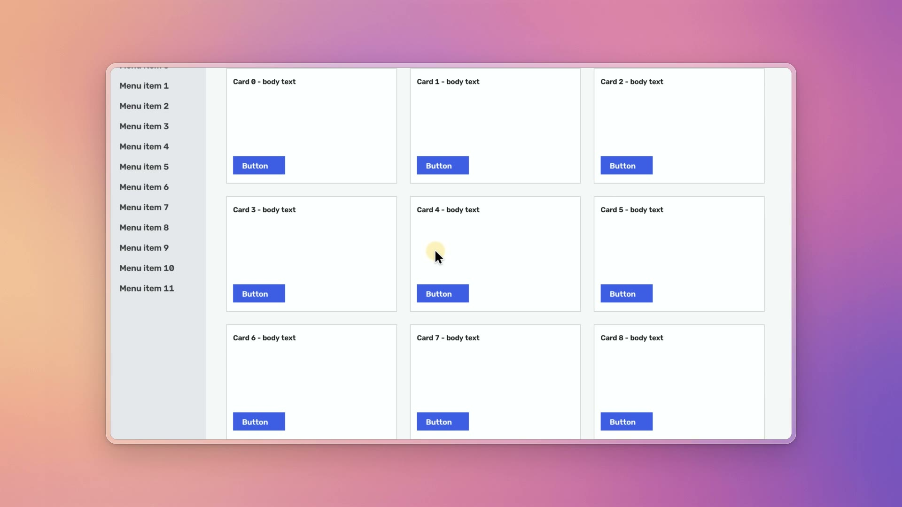
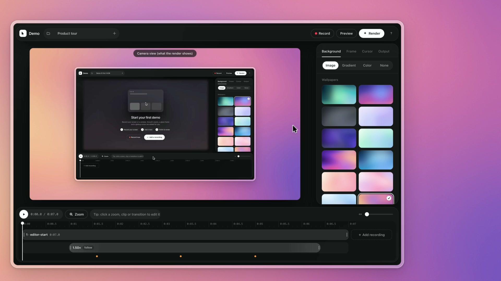
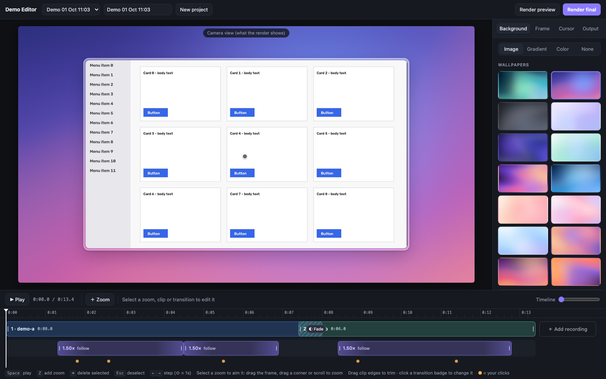

# demo-recorder

**Free, local screen recording for polished product demos on macOS.**

Record your screen, and demo-recorder turns it into a smooth demo video. The camera eases in on
what you click, the cursor glides, and your recording sits in a glass frame on a soft wallpaper.
It's the "auto zoom" look of paid screen recorders, running entirely on your Mac.



<table><tr>
<td></td>
<td></td>
</tr></table>

## Features

- **Automatic zooms.** Clicks that are close together become one gentle zoom that starts slightly *before* you click.
  Moves ease in and out and stop exactly on target, with no wobble.
- **Camera over the whole canvas.** It zooms and pans across the background, frame and recording together.
- **Smooth cursor.** Adjustable smoothing turns shaky hand movement into glides, while clicks still land exactly where you clicked.
  Choose from five cursor styles and add click ripples.
- **Glass frame.** Frosted rim, soft shadow, subtle inner and outer edge lines, and rounded corners.
- **Backgrounds.** 14 generated Apple-style wallpapers, linear or radial gradients, solid colours, or your own image.
- **Crop.** Cut away the menu bar, Dock or anything else.
- **Several recordings in one video.** Join them with cut, fade, slide or scale transitions.
- **Subtle motion blur.** It appears only during fast moves.
- **Timeline editor in your browser.** Aim and time every zoom by hand, trim clips, and render.
- **Nothing leaves your Mac.** No account, no upload, no watermark.

## Requirements

- macOS 14 or newer (the recorder uses ScreenCaptureKit)
- Xcode Command Line Tools (for `swift`): `xcode-select --install`
- Python 3.11+ and [Homebrew](https://brew.sh) (setup installs `ffmpeg` if it is missing)

## Install

```bash
git clone https://github.com/kaseelman/demo-recorder.git
cd demo-recorder
./setup.sh
```

On your first recording, macOS asks for permission. In **System Settings → Privacy & Security**, give the terminal
app you use (Terminal, iTerm, Ghostty…) these two permissions:

- **Screen Recording**, to capture the screen.
- **Accessibility** or **Input Monitoring**, to log mouse clicks and for the stop hotkey.

Restart the terminal after granting them.

## Make a demo in 3 steps

### 1. Record

```bash
./record
```

There's a 3-second countdown, then it records the display your mouse is on. Do your demo, then press **⌃⌥⌘S**
(or Ctrl-C in the terminal) to stop. The recording is saved to `~/Movies/Demo Recorder/recordings/<date_time>/`.

Tips:

- Pause for a moment before clicking something important. That gives the camera a beat to arrive.
- Move the mouse calmly. Smoothing takes care of the rest.
- `./record --list-displays` and `./record --display 1` pick a monitor. `--countdown 0` skips the countdown.

### 2. Edit

```bash
./edit
```

This opens the editor in your browser with your latest recording, with automatic zooms already placed.

| What | How |
|---|---|
| Play / scrub | `Space`, or click the ruler. `←` `→` step a frame (⇧ for 1s) |
| Aim a zoom | Click a purple zoom block, then drag the frame on the canvas. Drag a corner or scroll to zoom |
| Time a zoom | Drag a block to move it, drag its edges to change when it zooms in and out |
| Add / delete a zoom | `Z` or double-click the zoom lane, then `⌫` to delete |
| Follow cursor | In the zoom's bar: pan along when the cursor nears the edge |
| Trim a clip | Drag the edges of a blue clip |
| Crop | Select a clip, then **Crop…**. Drag the yellow box, or use **Hide menu bar** / **Hide dock** |
| Add a recording | **＋ Add recording** at the end of the timeline |
| Transition | Click the badge between two clips: cut, fade, slide or scale, plus a duration |
| Look | Right panel: **Background**, **Frame** (padding, corners, glass, shadow), **Cursor** (style, size, smoothing, motion blur), **Output** (aspect ratio, resolution) |

Everything saves automatically to `~/Movies/Demo Recorder/projects/<id>/project.json`. The preview shows exactly the camera motion the
render will use, because both come from the same code.

### 3. Render

Click **Render preview** for a quick half-size check, or **Render final** for the full-quality video. Then click
**Open** or **Show in Finder**. Videos are saved to `~/Movies/Demo Recorder/projects/<id>/final.mp4`.

## Your recordings stay private

Your recordings, projects and videos are stored in **`~/Movies/Demo Recorder/`**, outside the repository, so they
can never be committed by accident. (Set the `DEMOREC_DATA` environment variable to use another folder.) As
extra safety, a pre-commit hook (enabled by `setup.sh`) and a GitHub check refuse any commit that contains
video files, recordings or projects.

## Command line

You can do everything without the editor too:

```bash
./render                                  # latest recording, automatic zooms -> final.mp4 in its folder
./render ~/Movies/Demo\ Recorder/recordings/2026-10-01_14-03-12 --preview
./render ~/Movies/Demo\ Recorder/projects/2026-10-01_14-10-00     # render an editor project
./render <recording> --trim-start 1.5 --trim-end 2 --max-zoom 1.3 --no-blur -o demo.mp4
./edit <recording-folder>                 # start a new project from a specific recording
```

`config.toml` holds the defaults: how zooms are planned, camera timing, cursor, and the look of standalone
renders. Every setting is commented.

## How it works

1. **Recording.** `recorder/` is a small Swift tool using ScreenCaptureKit. It writes `raw.mov` at native
   resolution **without** the system cursor, plus `events.json`: every mouse move and click, on the same clock.
2. **Planning.** The camera works out where to go after the fact, from the click history, which is why it can
   start moving *before* a click. Nearby clicks merge into one zoom. Moves are eased curves of fixed length
   that stop dead on target.
3. **Compositing.** For every frame, the recording is warped straight from the source (so it stays sharp when
   zoomed in) onto a canvas with the background and glass frame. The cursor is drawn on top, and fast moves get a
   few blended sub-frames of motion blur.
4. **Encoding.** ffmpeg (VideoToolbox) writes the mp4.

## Project layout

```
record, render, edit, setup.sh   command-line entry points
config.toml                      defaults (commented)
recorder/                        Swift screen + mouse recorder
demorec/                         Python package: planning, compositing, export, editor server
editor/                          browser editor (HTML/CSS/ES modules, no build step)
tests/                           unit tests
scripts/, .githooks/, .github/   privacy guard (hook + CI) and checks
```

[ARCHITECTURE.md](ARCHITECTURE.md) explains every module, the coordinate spaces and how data flows.
AI assistants: see [AGENTS.md](AGENTS.md).

## Contributing

Contributions are very welcome. See [CONTRIBUTING.md](CONTRIBUTING.md).

## License

[PolyForm Noncommercial 1.0.0](LICENSE.md). You're free to use, study, modify and share demo-recorder for any
**noncommercial** purpose: personal projects, research, education, nonprofits and so on. Recording demos of your
own work with it is fine. You may **not** sell it, or offer it or a modified version as a paid product or service.
For commercial licensing, open an issue.

Strictly speaking, a noncommercial license is "source-available" rather than OSI open source. In every other way the
project follows open source norms: open code, open issues, and contributions under the same license.
